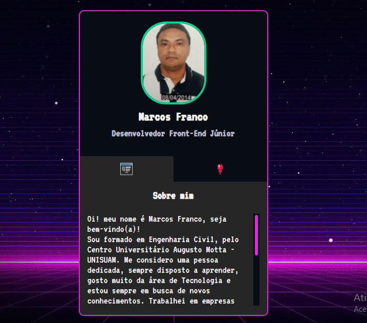

#   Projeto Mini Portfólio

## Descrição:
Projeto de um mini portfólio para desenvolvedores iniciantes, com informações pessoais e links de redes sociais.
Projeto desenvolvido no evento MapaDev Week.

[🔗 Clique aqui para acessar o site Mini Portfólio](https://marcos-franco.github.io/mini-portfolio/)

## Font family para utilização

- Family: [VT323](https://fonts.googleapis.com/css2?family=VT323)

## 🛠 Tecnologias:
- HTML
- CSS
- Javascript
- Git
- Github

## Status do Projeto:
100% Concluído

## Autor:
Projeto desenvolvido por [Marcos Franco](https://www.linkedin.com/in/marcosfranco-5b1a8a111/)

## 💛 Contatos:

Linkedin: https://www.linkedin.com/in/marcosfranco-5b1a8a111/

Repositório Github: https://github.com/marcos-franco

WhatSapp: https://contate.me/marcos-franco

E-mail: masf68@hotmail.com
